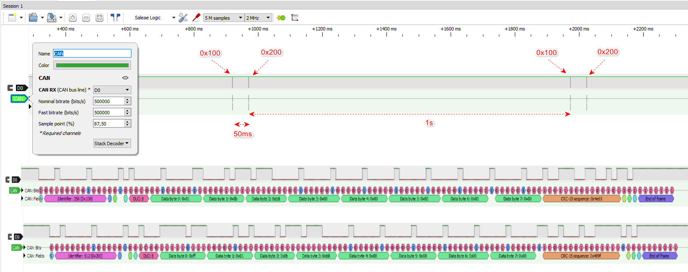

# CAN Bus HIL Test System

A Hardware-in-the-Loop (HIL) test bench built with BeagleBone Black and ESP32,
communicating over a physical CAN bus at 500 kbps.

---

## Hardware

| Component | Role | Interface |
|---|---|---|
| BeagleBone Black | HIL Master — sends test commands, validates responses | CAN0 (P9_19/P9_20) |
| ESP32 | HIL Slave — simulates ECU, processes commands | TWAI (GPIO4/GPIO5) |
| SN65HVD230 ×2 | CAN transceiver (3.3 V) | Differential CAN-H/CAN-L |
| 120 Ω resistors | Bus termination (both ends) | — |
| Saleae Logic Analyzer | Signal verification | CAN bus tap point |

---

## Wiring

```
BeagleBone Black          SN65HVD230 #1
P9_20 (TX) ─────────────► D
P9_19 (RX) ◄─────────────  R
P9_3  (3.3V) ───────────► VCC
P9_1  (GND) ────────────► GND
                           │
                        CAN-H ──[120Ω]──────────────────────── CAN-H
                        CAN-L ──────────────────────────[120Ω]── CAN-L
                                                                │
ESP32                     SN65HVD230 #2                        │
GPIO4 (TX) ─────────────► D                                    │
GPIO5 (RX) ◄─────────────  R                           ────────┘
3.3V       ─────────────► VCC
GND        ─────────────► GND
```

---

## CAN Bus Configuration

| Parameter | Value |
|---|---|
| Bitrate | 500 000 bps |
| Sample point | 87.5 % |
| Restart-ms | 100 ms |
| Frame format | Standard (11-bit ID) |
| DLC | 8 bytes |

---

## Message Protocol

### BBB → ESP32 (Command frame)

| Byte | Field | Description |
|---|---|---|
| 0 | CMD | Command code |
| 1 | VALUE_H | Value high byte |
| 2 | VALUE_L | Value low byte |
| 3–7 | — | Reserved (0x00) |

### ESP32 → BBB (Response frame)

| Byte | Field | Description |
|---|---|---|
| 0 | STATUS | 0xFF = OK, 0xEE = ERROR |
| 1 | CMD_ECHO | Echoed command code |
| 2 | VALUE_H | Echoed value high byte |
| 3 | VALUE_L | Echoed value low byte |
| 4–7 | — | Reserved (0x00) |

---

## CAN IDs

| ID | Node | Direction |
|---|---|---|
| 0x100 | BBB Master | TX |
| 0x200 | ESP32 Slave | TX |

---

## Test Scenarios

| Command | Code | Value | Expected Response |
|---|---|---|---|
| Heartbeat | 0x0F | 0x0000 | 0xFF (OK) |
| Engine RPM | 0x01 | 0–8000 RPM | 0xFF (OK) |
| Fuel Injection | 0x02 | 0x001F | 0xFF (OK) |
| Temperature Sensor | 0x03 | 0–150 °C | 0xFF (OK) |

---

## Test Results

```
Totalt=16  Successful=16  Failed=0
RX=18  TX=18  ERR=0
```

All test scenarios passed at 500 kbps with zero CRC errors,
verified with Saleae Logic Analyzer.

---

## Logic Analyzer Capture

Signal captured on CAN-H line at 500 kbps, 87.5 % sample point.

- **0x100** — BBB master command frame (Engine RPM, 3000)
- **0x200** — ESP32 slave response frame (STATUS=0xFF, OK)
- Frame interval: ~50 ms
- Round-trip latency: < 1 ms



---

## Software

### BeagleBone Black — C / SocketCAN

```bash
# Activate CAN interface
config-pin P9_19 can
config-pin P9_20 can
sudo ip link set can0 type can bitrate 500000 sample-point 0.875 restart-ms 100
sudo ip link set can0 up

# Build and run
gcc -o hil_master hil_master.c
sudo ./hil_master can0
```

### ESP32 — C++ / Arduino TWAI (PlatformIO)

```bash
# Build and upload via PlatformIO
pio run --target upload --environment esp32dev
pio device monitor --port COM9 --baud 115200
```

---

## Project Structure

```
hil_project/
├── hil_master.c          # BBB master — SocketCAN
├── hil_slave/
│   ├── src/
│   │   └── main.cpp      # ESP32 slave — TWAI
│   └── platformio.ini
├── logs/
│   ├── hil_log.txt       # BBB automated test report
│   └── hil_slave_log.txt # ESP32 serial monitor output
├── docs/
│   └── logic_analyzer.png
└── README.md
```

---

## Log Files

### BBB — `logs/hil_log.txt`

Automatically generated by `hil_master` on every test run.
Contains timestamped pass/fail results for each test scenario.

```
[11:10:49] HIL Master baslatildi - can0 @ 500kbps
[11:10:49] GONDERILDI: [Heartbeat] CMD=0x0F VALUE=0
[11:10:49] BASARILI: [Heartbeat] ESP32 cevabi OK
[11:10:50] GONDERILDI: [Motor RPM 3000] CMD=0x01 VALUE=3000
[11:10:50] BASARILI: [Motor RPM 3000] ESP32 cevabi OK
[11:10:51] GONDERILDI: [Yakit Enjeksiyonu] CMD=0x02 VALUE=31
[11:10:51] BASARILI: [Yakit Enjeksiyonu] ESP32 cevabi OK
[11:10:52] GONDERILDI: [Sicaklik 85C] CMD=0x03 VALUE=85
[11:10:52] BASARILI: [Sicaklik 85C] ESP32 cevabi OK
[11:10:53] OZET: Toplam=4 Basarili=4 Basarisiz=0
```

### ESP32 — `logs/hil_slave_log.txt`

Captured from PlatformIO Serial Monitor during test run.

```
===========================================
  HIL Slave - ESP32
  CAN Bus HIL Test Sistemi v1.0
===========================================
[OK] TWAI baslatildi - 500kbps
[OK] BBB'den komut bekleniyor...

[RX] Frame alindi: ID=0x100 CMD=0x0F VALUE=0
[CMD] Heartbeat alindi
[TX] Cevap gonderildi: STATUS=0xFF CMD=0x0F
[RX] Frame alindi: ID=0x100 CMD=0x01 VALUE=3000
[CMD] Motor RPM komutu: 3000 RPM
[TX] Cevap gonderildi: STATUS=0xFF CMD=0x01
[RX] Frame alindi: ID=0x100 CMD=0x02 VALUE=31
[CMD] Yakit enjeksiyonu komutu: 0x001F
[TX] Cevap gonderildi: STATUS=0xFF CMD=0x02
[RX] Frame alindi: ID=0x100 CMD=0x03 VALUE=85
[CMD] Sicaklik komutu: 85 C
[TX] Cevap gonderildi: STATUS=0xFF CMD=0x03
[STAT] RX=18 TX=18 ERR=0
```

---

## Skills Demonstrated

- CAN bus physical layer design (termination, twisted-pair wiring)
- HIL master/slave architecture
- SocketCAN on Linux (BeagleBone Black)
- ESP32 TWAI driver (Arduino framework)
- Signal verification with logic analyzer
- Automated test logging and pass/fail reporting

---

## Relevance to Automotive Industry

This project mirrors real HIL test bench setups used in automotive
development (Volvo Cars, Bosch, Continental) where ECU behaviour is
validated against simulated signals before integration with physical
hardware. Test scenarios follow the same request–response pattern
used in production CAN diagnostics (UDS, J1939).
